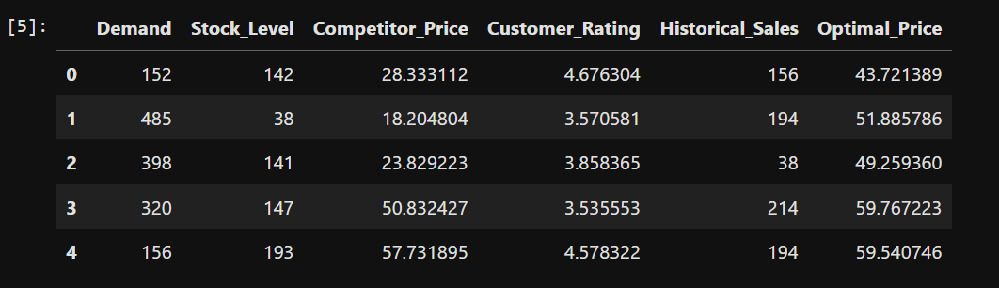
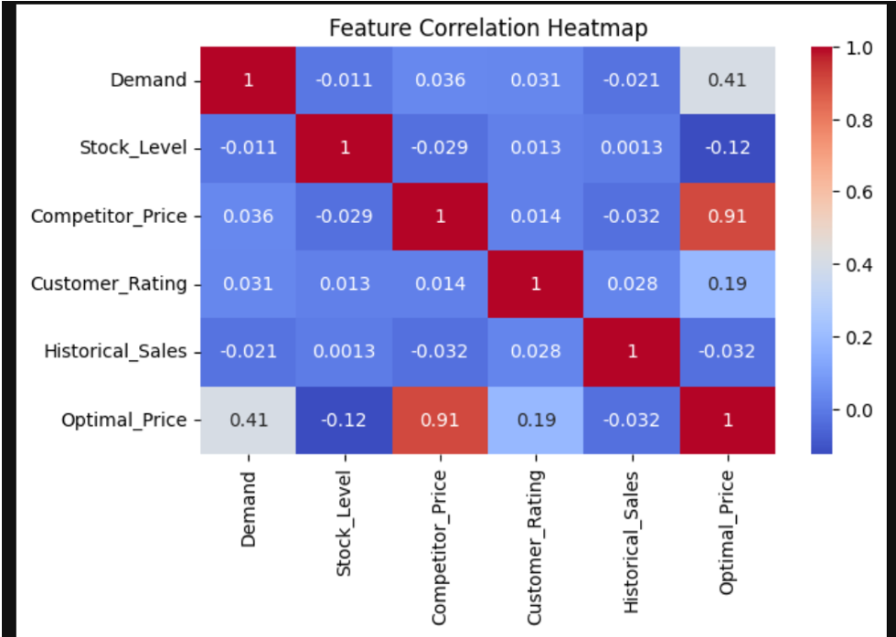
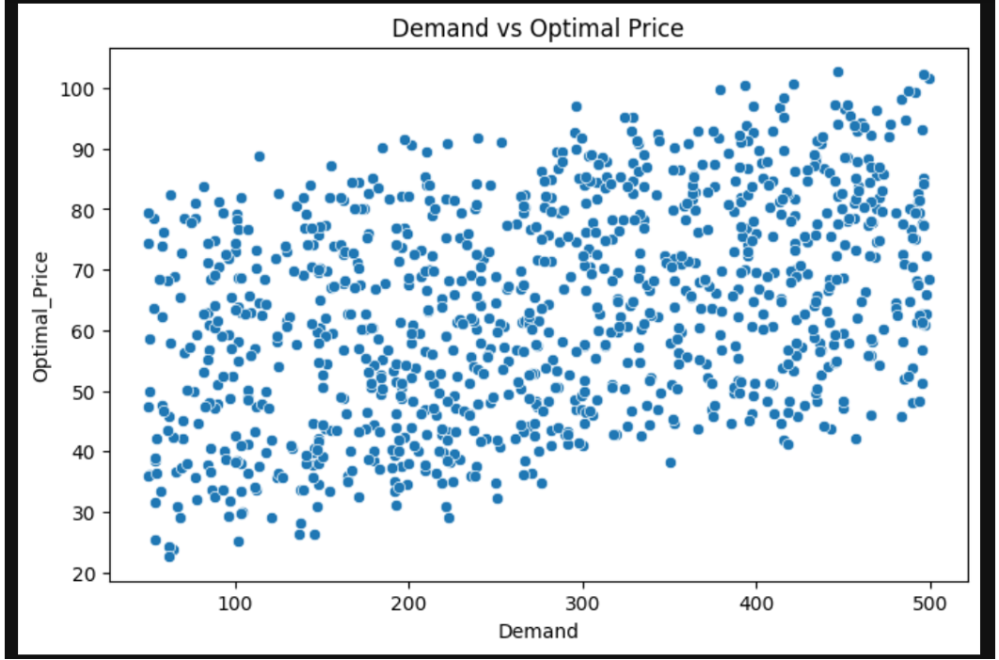
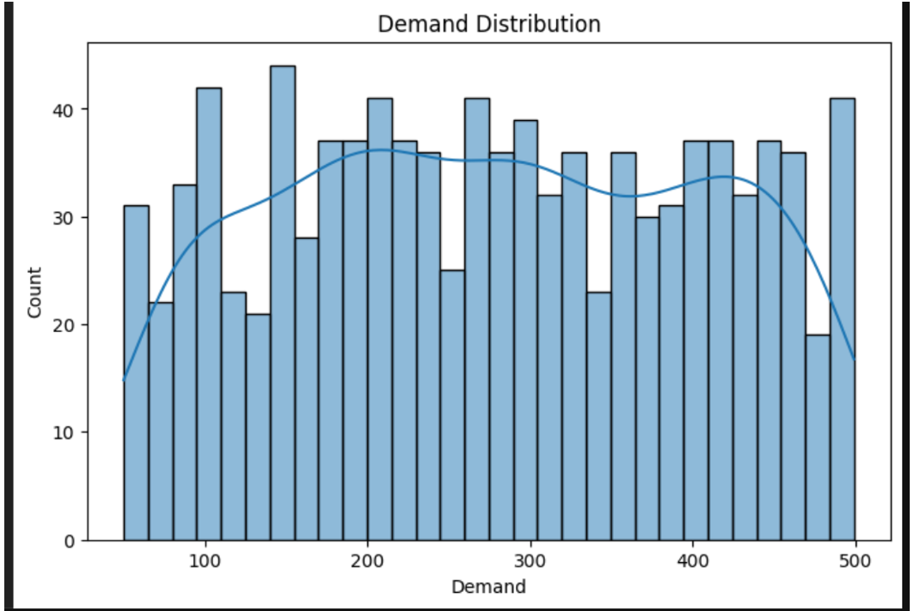
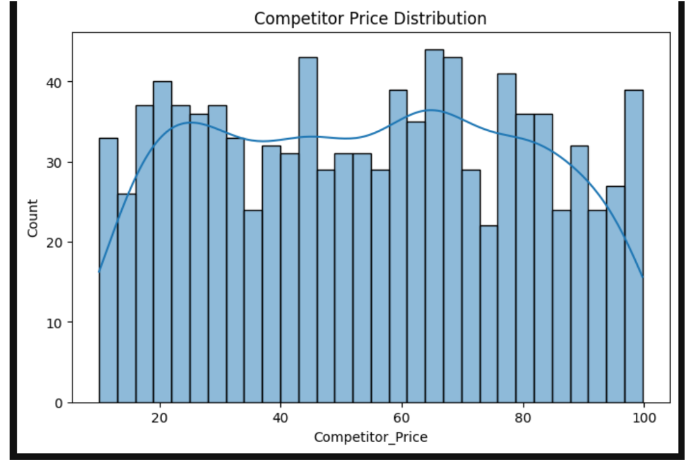
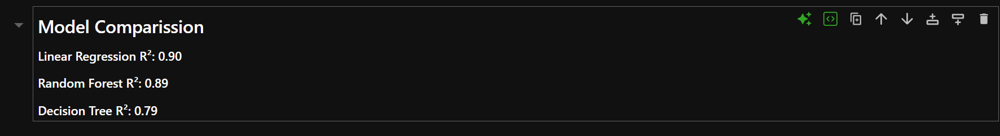
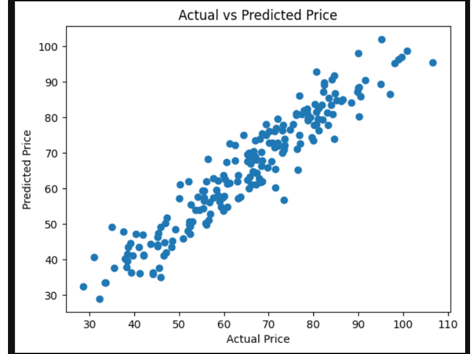
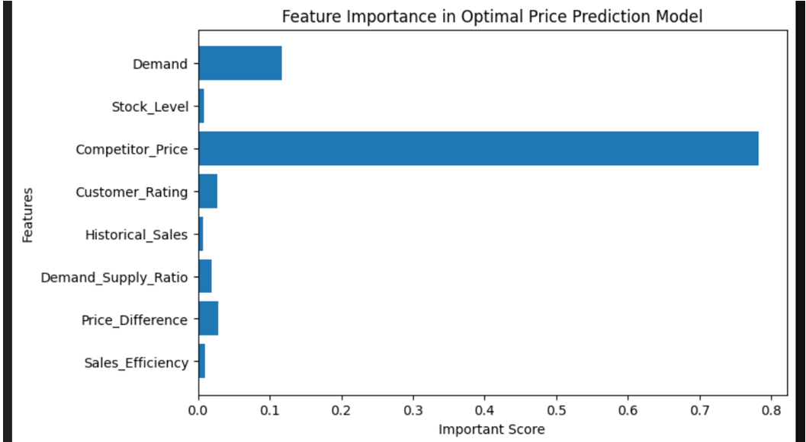

# 💰 Dynamic Pricing Model — Machine Learning


> 🚀 A Machine Learning project comparing three powerful pricing models
> to determine the most accurate dynamic pricing strategy using
> a self-created synthetic dataset — complete with residual analysis,
> data visualization and actionable business insights.

---

## 📌 Project Overview

Dynamic pricing is a strategy where prices are adjusted in real-time
based on demand, competition, and market conditions. This project
builds and compares **3 ML models** to find the best approach for
predicting optimal prices. The entire dataset was **created from scratch
using Python** to ensure complete originality.

---

## 🗄️ Dataset — Self Created Synthetic Data

> 💡 The dataset was entirely built from scratch using Python — no external data source used!



### Features Used:
| Feature | Description |
|---|---|
| `Demand` | Customer demand level |
| `Stock_Level` | Current inventory stock |
| `Competitor_Price` | Competitor's current pricing |
| `Customer_Rating` | Average customer rating |
| `Historical_Sales` | Past sales performance |
| `Demand_Supply_Ratio` | Ratio of demand to supply |
| `Price_Difference` | Gap between our price & competitor |
| `Sales_Efficiency` | Sales performance efficiency score |
| `Optimal_Price` | 🎯 Target variable — price to predict |

---

## 📊 Exploratory Data Analysis

### 🔥 Feature Correlation Heatmap
> Shows relationship between all features — Competitor_Price has **0.91 correlation** with Optimal_Price!



### 📈 Demand vs Optimal Price
> Clear positive trend — higher demand leads to higher optimal pricing



### 📊 Demand Distribution
> Shows how demand is spread across the dataset



### 📊 Competitor Price Distribution
> Uniform distribution of competitor prices across the range



---

## 🤖 Models Built & Compared

| Model | Type | Strength |
|---|---|---|
| 📈 Linear Regression | Parametric | Simple & interpretable baseline |
| 🌳 Decision Tree | Non-Parametric | Rule-based price segmentation |
| 🌲 Random Forest | Ensemble | Highest accuracy prediction |

---

## 📉 Model Results & Performance

### 🏅 Model Comparison Scores
> Side-by-side accuracy comparison of all 3 models



### 🎯 Actual vs Predicted Price
> Strong diagonal alignment shows excellent model prediction accuracy!



### 🔑 Feature Importance in Optimal Price Prediction
> **Competitor_Price** dominates with ~0.78 importance score — the strongest pricing signal!



---

## 💡 Business Insights

- 🏆 **Competitor Price** is the strongest predictor of optimal pricing (0.78 importance score)
- 📈 **Demand** is the second most influential factor (0.11 importance score)
- 🌲 **Random Forest** delivers the highest accuracy among all 3 models
- 🌳 **Decision Tree** provides the most interpretable pricing rules for business teams
- 📊 Strong **0.91 correlation** between Competitor Price and Optimal Price
- 💰 Higher demand consistently drives higher optimal pricing strategies

---

## 🔮 Future Suggestions

- 🔄 Add real-world pricing data to validate synthetic results
- 📦 Include seasonal demand trends as additional features
- ⚡ Deploy as a real-time pricing API using Flask or FastAPI
- 🧠 Experiment with XGBoost and Neural Networks for better accuracy
- 📊 Add demand elasticity coefficient as a feature

---

## 📂 Project Structure

```
Dynamic-Pricing-Model/
│
├── Dynamic_pricing_model.ipynb         # Main Jupyter Notebook
├── dataset_sample.png                  # Raw synthetic dataset preview
├── feature_correlation_heatmap.png     # Feature correlation analysis
├── demand_vs_optimal_price.png         # Demand vs price relationship
├── demand_distribution.png             # Demand data distribution
├── competitor_price_distribution.png   # Competitor price distribution
├── actual_vs_predicted.png             # Model prediction results
├── feature_importance.png              # Feature importance chart
└── model_comparison_scores.png         # All 3 model scores comparison
```

---

## 🛠️ Tools & Technologies

| Tool | Usage |
|---|---|
| **Python** | Core programming language |
| **Scikit-Learn** | ML model building |
| **Pandas** | Data manipulation & synthetic data creation |
| **NumPy** | Numerical computations |
| **Matplotlib** | Data visualization |
| **Seaborn** | Statistical visualization |
| **Jupyter Notebook** | Development environment |

---

## 👨‍💻 Author

**Devesh Shukla**

[](https://www.linkedin.com/in/devesh-shukla23)
[](https://github.com/DeveshShukla23)
[](mailto:shukladevesh40@gmail.com)
